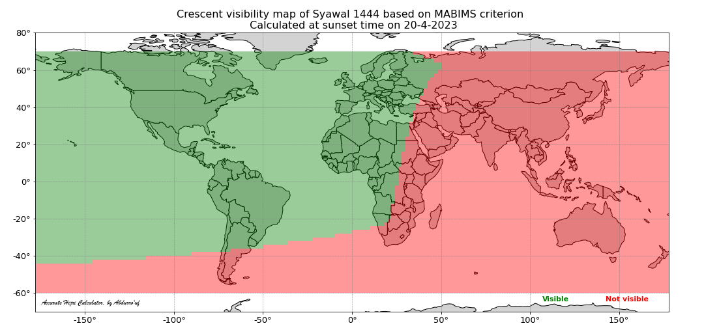
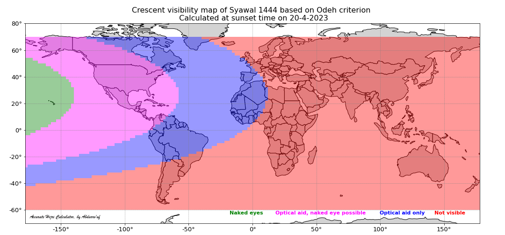

# Astro Kalkulator

Boleh mencari data berkenaan:
- Ijtimak
- Kedudukan Matahari dan Bulan pada waktu Ijtimak
- Waktu Solat
- Arah Kiblat menggunakan bayang-bayang Matahari

Tutorial untuk setup boleh lihat di YouTube https://www.youtube.com/watch?v=oeXbSYYx7hI         

## Installation
Langkah pertama adalah memastikan sistem mempunyai Python

Kemudian copy dulu fail ke dalam folder yang dikehendaki

```
git clone https://github.com/duokino/astrokalkulator.git
```

Pastikan anda menjalankan file setup.py supaya ia install kesemua file dependency dan database berkaitan

```
python setup.py
```

Untuk memastikan anda menggunakan database kedudukan objek langit (dexxx.bsp) dan juga location.txt yang terkini, disarankan untuk menjalankan file update.py

```
python update.py
```

## Fungsi yang boleh digunakan

### 1. Mendapatkan maklumat berkenaan Ijtimak

lokasi default adalah Batu Pahat
masukkan tahun hijri dan bulan hijri
```ruby
python ijtimak.py 1446 9
```

Sekiranya hendak menentukan lokasi berbeza dari default
```ruby
python ijtimak.py --location=telukkemang
```

untuk database lokasi boleh didapati dari file database/location.txt

### 2. Melihat kedudukan Matahri dan Bulan ketika Ijtimak 

This include maps of moon altitude, elongation (topocentric and geocentric), moon-sun altitude difference (arc of vision; ARCV), moon width, and moon age. Below is an example line of script to get the map of moon altitude.
```ruby
hl.map_moon_altitude()
```


### 3. Get map of crescent vibility based on various criteria
There are 6 criteria that are currently available in AHC: MABIMS, Odeh, Wujudul Hilal, Turkey, Danjon, and Itjima Qobla Ghurub.

#### 3.1. Crescent vibility map based on MABIMS criteria
This citeria is currently (as of 2023) used by the goverments of Indonesia, Malaysia, Singapore, and Brunei Darussalam.
```ruby
hl.map_hilal_visibility('MABIMS')
```


#### 3.2. Crescent visibility map based on Odeh criteria
This criteria is proposed by Mohammad Odeh in his 2016 [paper](https://link.springer.com/article/10.1007/s10686-005-9002-5) published in the Journal of Experimantal Astronomy.
```ruby 
hl.map_hilal_visibility('Odeh')
```


#### 3.3. Crescent visibility map based on Terkey criteria
This criteria is proposed by the International Hijri Calendar Union Congress in Istanbul in 2016 to be the criteria for the unified Hijri calendar.
```ruby
hl.map_hilal_visibility('Turkey')
```

