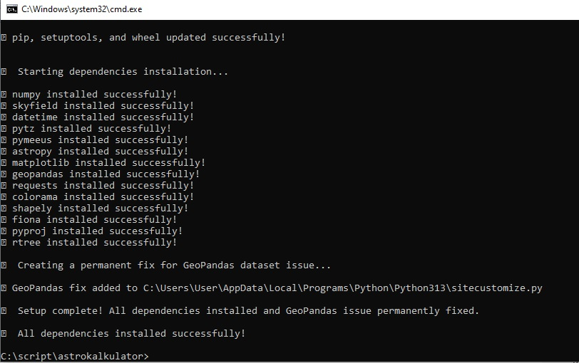
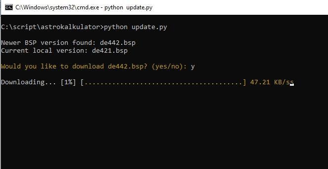
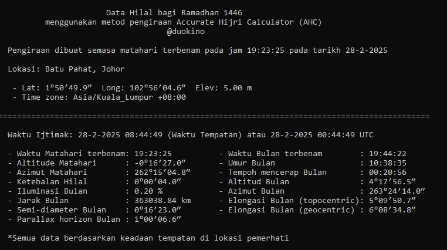
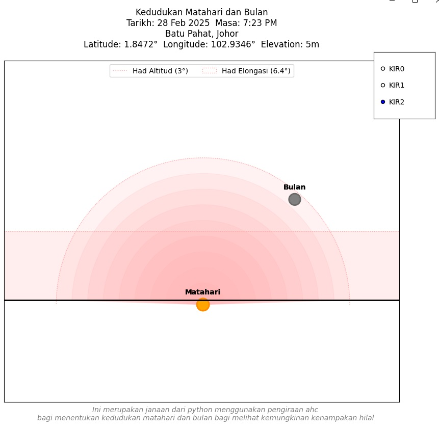
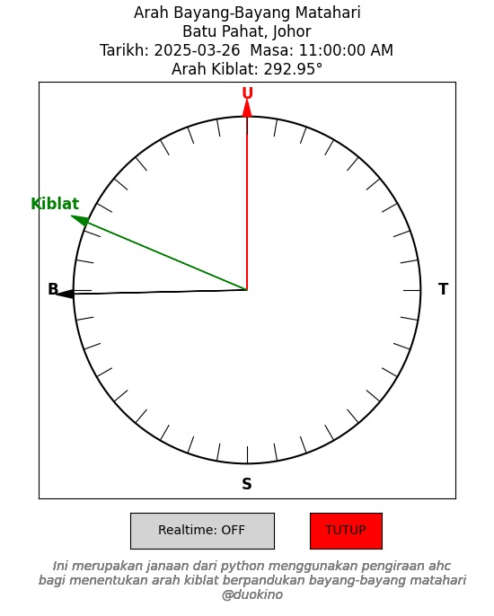
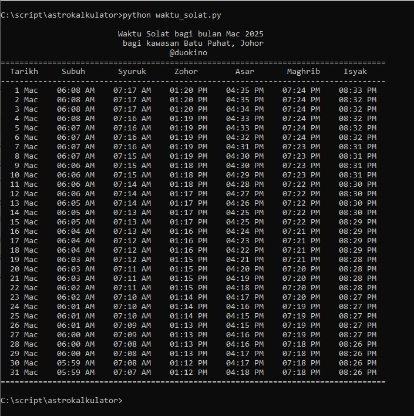

# Astro Kalkulator

Boleh mencari data berkenaan:
- Ijtimak
- Kedudukan Matahari dan Bulan pada waktu Ijtimak
- Arah Kiblat menggunakan bayang-bayang Matahari
- Waktu Solat

Tutorial untuk setup boleh lihat di YouTube https://www.youtube.com/watch?v=oeXbSYYx7hI         

## Installation
Langkah pertama adalah memastikan sistem mempunyai Python. Boleh dapatkan di laman webrasmi Python di https://www.python.org/downloads/

Kemudian copy dulu fail ke dalam folder yang dikehendaki

```ruby
git clone https://github.com/duokino/astrokalkulator.git
```
Boleh juga download ZIP kemudian extract ke folder yang dikehendaki.

Pastikan anda menjalankan file setup.py supaya ia install kesemua file dependency dan database berkaitan

```ruby
python setup.py
```


Untuk memastikan anda menggunakan database kedudukan objek langit (dexxx.bsp) dan juga location.txt yang terkini, disarankan untuk menjalankan file update.py

```ruby
python update.py
```



## Fungsi yang boleh digunakan


### 1. Mendapatkan maklumat berkenaan Ijtimak

lokasi default adalah Batu Pahat. Masukkan tahun hijri dan bulan hijri
```ruby
python ijtimak.py 1446 9
```


Sekiranya hendak menentukan lokasi berbeza dari default
```ruby
python ijtimak.py --location=telukkemang
```

Sekiranya hari melihat anak bulan sehari kemudian dari Ijtimak (kerana ijtimak berlaku selepas maghrib) maka perlu dimasukkan parameter offset=1
```ruby
python ijtimak.py --offset=1
```

untuk database lokasi boleh didapati dari file database/location.txt


### 2. Melihat kedudukan Matahri dan Bulan ketika Ijtimak 

lokasi default adalah Batu Pahat. Masukkan tarikh dalam format (YYYYMMDD)
```ruby
python tunjuk_hilal.py --date=20250228
```



### 3. Arah Kiblat menggunakan bayang-bayang Matahari 

lokasi default adalah Batu Pahat dengan menggunakan masa realtime
```ruby
python arah_kiblat.py
```


Sekiranya hendak mengubah lokasi berdasarkan dalam database/location.txt
```ruby
python arah_kiblat.py --location=telukkemang
```

Sekiranya hendak memasukkan tarikh dan masa tertentu menggunakan format (YYYY-MM-DD) dan (HH:MM:SS)
```ruby
python arah_kiblat.py --date=20250327 --time=11:00:00
```


### 4. Waktu Solat

Boleh menjana waktu solat mengikut kawasan.

Untuk menjana waktu solat untuk sebulan, lokasi default adalah Batu Pahat. Secara default adalah bulan semasa.
```ruby
python waktu_solat.py
```


Sekiranya hendak menjana bulan tertentu, masukkan tahun dan bulan
```ruby
python waktu_solat.py 2025 3
```

Sekiranya hendak menukar lokasi, boleh rujuk senarai di  database/location.txt
```ruby
python waktu_solat.py 2025 3 --location=paritraja
```

